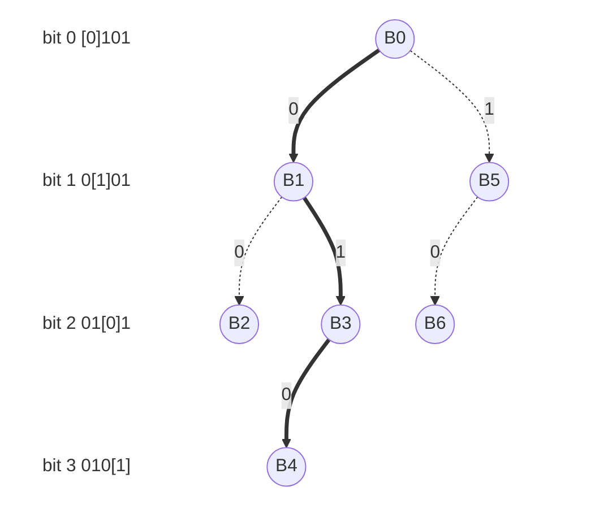

# ip-graph-cxx
C and C++ code for IP graph

## Introduction

The conceptual data structure read by `graph.c` is a binary tree structure.
Whereby the "zero" child is the next node to evaluate if the input value is `0`,
and the "one" child is the next node to evaluate if the input value is `1`.

Evaluation (in brief) is carried out on a series of bits by moving from the most
significant bit to the least. And for each bit, moving the the "zero" or "one" child
in the evaluation tree, which will then become the node used to evaluate the next bit.

## Data Structure

### Collection Graph Info

Each graph is a collection of graph nodes, which are not necessarily compatible
with nodes from another graph (even in the same data file). A graph therefore
has an accompanying header called a "collection graph info" structure.
This contains info about the graph which is referred to.

A collection graph info contains the following:

| Item | Description |
| ---- | ----------- |
| RecordSize | The size in bytes of each node record |
| FirstProfileIndex | The first index in the entire collection of profile offsets which is pointed to by the graph results. Meaning that, for a profile offset index returned by evaluation of the graph, the index in the whole collection of profile offsets is `index + FirstProfileIndex` |
| FirstProfileGroupIndex | The first index in the entire collection of profile groups which is pointed to by the graph results. Meaning that, for a profile group index returned by evaluation of the graph, the index in the whole collection of profile groups is `index + FirstProfileGroupIndex` |
| ValueMask | The mask and shift used to obtain the next index or value from a node value |
| ZeroFlag | The mask and shift used to obtain the zero flag from a node value |
| SkipZero | The mask and shift used to obtain the zero skip bits |
| SkipOne | The mask and shift used to obtain the one skip bits |

Note that all the mask items in the above structure are known as a 
"collection graph member". These contain:
| Item | Description |
| ---- | ----------- |
| Mask | The bitmask to apply to the node bytes |
| Shift | The left shift to apply to the node bytes AFTER applying the mask |

It is important to apply the mask before the shift.

### Graph Structure

The collection used by the `graph.c` is written as an array of nodes.
The basic format of each node is:

| `byte[]` |
| -------- |
| Index of the "one" child |

The size of each byte array is a maximum of 8 bytes (to hold a 64bit number).
In practice, the number of indexes required are much less than this, so a lower number can be used. The exact number is determined by the size of the data being written, but for this explanation, let's assume it's 4 bytes.

Bytes are written as little endian, so make shift comparisons easier.

**TODO check implementation endianness**

| `4 bytes` |
| --------- |
| Index of the "one" child |

The index of the "zero" child is not written, as by convention, this is the next node. So the "zero" child will the next node in the collection.

### Bit Flags

The index is also used for other purposes, and bit flags are used to indicate what is stored in bytes.

#### Zero Leaf Bit

Leaf nodes and branch nodes are distinguished by whether or not the index value is larger than the total number of nodes. Where instead of pointing to a leaf node, an index is used to store the leafs value, where the actual value stored is the value + total nodes. For example, in a tree with 100 nodes, any branch node could be pointed to with an index < 100, and any leaf node could be represented as 100 + value.

A leaf node in this example might have the value `101`, indicating that the value is `1`.

This means that instead of pointing to a leaf node, which in turn points to a value. The final branch node points to the value instead of the leaf node.

Using this method leads to a conflict, whereby a "zero" child cannot be a leaf node. i.e. if the node was a "zero" child, and had the value `101`, it would not be possible to distinguish between that being a "zero" node that was a leaf, or a node that indicated its "one" child was a leaf. This is a consequence of collapsing the leaf node into the parent node.

To make the distinction between these two nodes, the highest order bit is used to indicate if the node is a leaf node to the "zero" side of its parent.
If the bit is 1, the node is "zero" leaf for its parent. Otherwise the node value points to a value for its "one" child.

#### Skip Bits

Skipping is implemented by using bits 1, 2, and 3 (the next 3 bits after the zero leaf bit). These make up an integer which, if non zero, indicate the number of additional bits to advance by in the key. In an example where 2 extra bits should be skipped, a node would have a value of 2 stored. So the bit value would be `00100...` where the first bit is zero (indicating not a "zero" leaf), the next 3 bits are the skip, and the rest is the index of the "one" node or value (truncated). The number of bits used for the skip number can be changed depending on the dataset, but must be constant within a single tree.

#### Accessing

Each bit flag which is used for another purpose is accessed using a bit mask, and a bit shift.

To get the value of a bit flag, the process is:
1. apply the bit mask,
2. right shift the bits by the shift

Each bit flag will have a different combination of mask and shift, which is constant within the data structure.

As the shift is applied first, a flag which is a single bit can more efficiently be evaluated by ignoring the shift step. Any conditions based on this flag can then just check if the flag is zero or non-zero (any non-zero value is treated as 1, as we know that's what it will be after the shift).

------------

To explain further, below are a few examples of nodes, and what they represent.
To simplify, each node is only 1 byte.
For the example, assume the number of nodes are 10.

Zero is the next node, one is the node at index 2:
| **Bit**   | 0 | 1 | 2 | 3 | 4 | 5 | 6 | 7 |
| --------: | - | - | - | - | - | - | - | - |
| **Value** | 0 | 0 | 0 | 0 | 0 | 0 | 1 | 0 |

Zero is the next node, one is the leaf value 12 - 10 = 2:
| **Bit**   | 0 | 1 | 2 | 3 | 4 | 5 | 6 | 7 |
| --------: | - | - | - | - | - | - | - | - |
| **Value** | 0 | 0 | 0 | 0 | 1 | 1 | 0 | 0 |

This node represents the zero leaf value of the previous node 12 - 10 = 2:
| **Bit**   | 0 | 1 | 2 | 3 | 4 | 5 | 6 | 7 |
| --------: | - | - | - | - | - | - | - | - |
| **Value** | 1 | 0 | 0 | 0 | 1 | 1 | 0 | 0 |

Zero is the next node, one is the node at index 2, and an extra 2 bits should be skipped in the key before evaluating:
| **Bit**   | 0 | 1 | 2 | 3 | 4 | 5 | 6 | 7 |
| --------: | - | - | - | - | - | - | - | - |
| **Value** | 0 | 0 | 1 | 0 | 0 | 0 | 1 | 0 |

 
## Usage

To use the data structure, it is read into memory as an array of nodes. Each node holds a byte array.

To match a key (i.e. an IP within a range), the IP is stored in memory as its byte representation. For example, `1.255.1.0` would become `00000001 11111111 00000001 00000000` (bytes are written as little endian). Using a bit mask of a single bit, and going from most to least significant bit, we use the value in the key to determine whether to go to the "zero" or "one" child in the tree.

If the bit value at the current position is `0`, we move to the "zero" node (the next node in the array) and then evaluate the next bit to the right. Alternatively, if the value is `1`, we move to the "one" node (the node at the index provided by the current node).

The rules about leafs are followed, so if at any point a leaf is reached, then the evaluation is complete, and that value returned. These rules are defined in the previous data structure section.

## Example

As an example, using a shortened key value of `0101`, a search would go as follows:

Where the values of the nodes are:

| Node | Value (bits) | Notes |
| ---- | ----- | ----- |
| B0   | 00101 | the integer value 5 points to the index of the next "one" node (B5) |
| B1   | 00011 | this is the implied "zero" child of B0, the integer value 3 points to a "one" node (B3) |
| B2   | 11000 | this is the implied "zero" node of B1, the first bit is 1, indicating this is a "zero" leaf, and the integer value 8 that follows means the value of the leaf `8-7=1` |
| B3   | 01001 | the integer value 9 means the value of the "one" leaf is `9-7=2` |
| B4   | 11011 | the first bit is 1, indicating this is a "zero" leaf, and the integer value 11 that follows means the value of the leaf if `11-7=4` |
| B5   | 00111 | the integer value 7 means the value of a "one" leaf is `7-7=0` |
| B6   | 11010 | the first bit is 1, indicating this is a "zero" leaf, and the integer value 10 that follows means the value of the leaf is `10-7=3` |

So the search for the key `0101` goes:
1. (at B0) the first bit is `0`, so go to the next node in the array (B2)
2. (at B1) the second bit is `1`, so go to the node pointed to by the index in B1 (B3)
3. (at B3) the third but is `0`, so go to the next node in the array (B4)
4. (at B4) the first bit of the node is `1`, so there's no need to evaluate the fourth bit of the key, as this is a leaf. The value after masking the first bit is 11. So subtracting the number of nodes (7) gives a result of 4.

The result `4` can then be used to look up all values for that IP range.